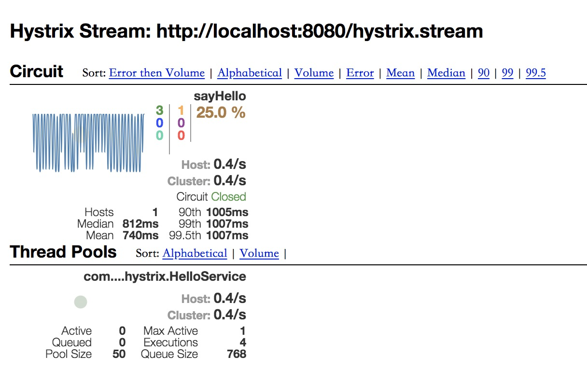

# sofa-rpc-hystrix with spring-cloud-hystrix

在 Spring Boot（Sofa Boot） 项目中使用了 Sofa RPC Hystrix 后，通过 Spring Cloud Hystrix 展示 Dashboard 以及更改配置。

分别启动该项目的 QuickStartServer 和 QuickStartClient

最后打开 `http://localhost:8080/hystrix/monitor?stream=http%3A%2F%2Flocalhost%3A8080%2Factuator%2Fhystrix.stream` 查看 Dashboard：

Spring Boot/Cloud 1.x 版本见 1.x 分支